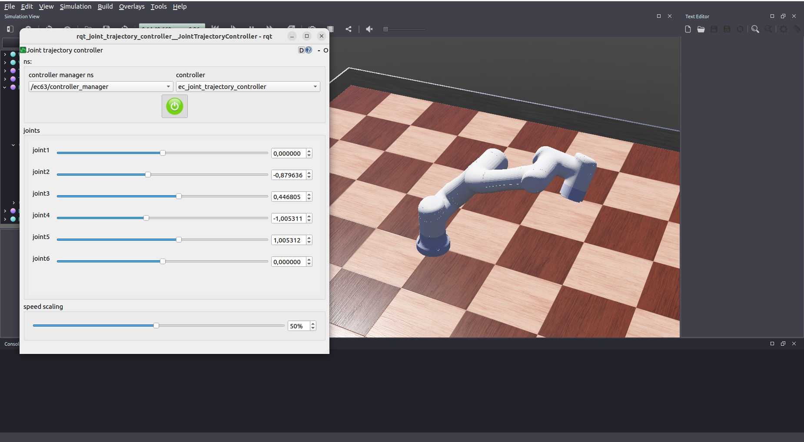

# Webots simulation for EC63

To run the simulation, execute the command

```bash
webots worlds/table.wbt
```

## Dependencies

To install all dependencies, run the command

```bash
rosdep install --from-path .
```

## ROS 2 integration

To start the simulation with ROS 2 interfaces, execute the following commands

```bash
ros2 launch ec63_webots robot_world_launch.py # starts the simulation
ros2 launch ec63_webots robot_nodes_launch.py # starts the controller
```

Position commands should then be published in the topic `/ec63/ec_joint_trajectory_controller/joint_trajectory`

Example:

```bash
ros2 topic pub --once /ec63/ec_joint_trajectory_controller/joint_trajectory \
    trajectory_msgs/msg/JointTrajectory \
    "{
        joint_names: ['joint1', 'joint2', 'joint3', 'joint4', 'joint5', 'joint6'],
        points: [
            {
                positions: [1.0, -1.0, -1.0, 1.0, 1.0, 0.0], 
                time_from_start: {sec: 1, nanosec: 0}
            }
        ]
    }"
```

It's possible to use `rqt_joint_trajectory_controller` to evaluate the movement of the robot with a graphical tool

```bash
ros2 run rqt_joint_trajectory_controller rqt_joint_trajectory_controller --ros-args --remap /robot_description:=/ec63/robot_description
```



## Copyright notice

EC63 model converted from [Elite-Robots/ROS](https://github.com/Elite-Robots/ROS)

All rights reserved to Elite Robots
